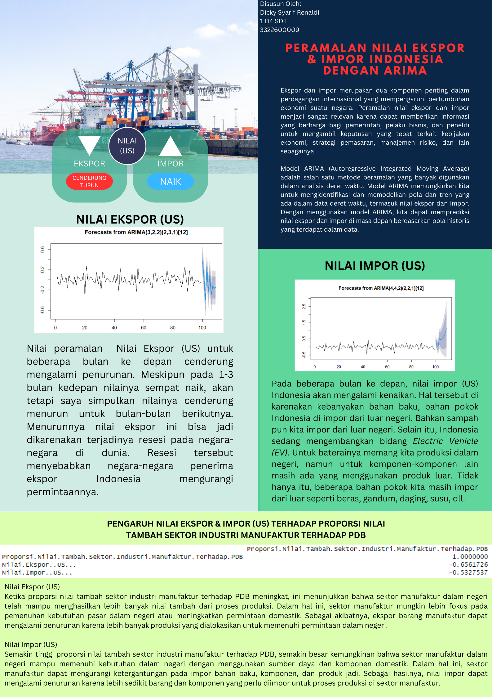

# Peramalan Nilai Ekspor dan Impor Indonesia Menggunakan ARIMA dan ARIMAX

Proyek ini membahas analisis dan peramalan nilai ekspor serta impor Indonesia menggunakan metode deret waktu ARIMA, SARIMA, dan ARIMAX. Selain peramalan, proyek ini menganalisis hubungan antara aktivitas ekspor-impor dan proporsi nilai tambah sektor industri manufaktur terhadap Produk Domestik Bruto (PDB) menggunakan regresi linear.

Data perdagangan yang dianalisis mencakup periode Januari 2014 sampai Maret 2023, sedangkan analisis regresi menggunakan data tahunan periode 2014–2022.

## Tujuan Proyek

- Meramalkan nilai ekspor Indonesia berdasarkan data historis.
- Meramalkan nilai impor Indonesia berdasarkan data historis.
- Memodelkan nilai ekspor dan impor dengan berat perdagangan sebagai variabel eksternal menggunakan ARIMAX.
- Menganalisis hubungan nilai dan berat ekspor-impor dengan proporsi nilai tambah sektor industri manufaktur terhadap PDB.

## Dataset

Proyek ini menggunakan dua dataset olahan utama:

| Dataset | Periode | Kegunaan |
|---|---|---|
| `data_ekspor.csv` | Januari 2014–Maret 2023 | Pemodelan ARIMA, SARIMA, dan ARIMAX |
| `data_pdb_ekspor_impor.csv` | 2014–2022 | Pemodelan regresi linear |

Variabel yang digunakan meliputi:

- Nilai ekspor dalam US$.
- Berat ekspor dalam kilogram.
- Nilai impor dalam US$.
- Berat impor dalam kilogram.
- Proporsi nilai tambah sektor industri manufaktur terhadap PDB.

Data juga tersedia dalam berkas tahunan dari 2014 hingga 2023 dan beberapa berkas Excel berdasarkan kelompok periode. Data tahun 2023 hanya mencakup Januari sampai Maret.

> **Catatan:** Informasi mengenai sumber asli dan lisensi dataset belum tercantum dalam proyek ini dan perlu dilengkapi apabila tersedia.

## Metode Analisis

### Analisis Deret Waktu

Tahapan analisis nilai ekspor dan impor meliputi:

- Eksplorasi dan visualisasi deret waktu.
- Pemeriksaan pola ACF dan PACF.
- Transformasi logaritma dan differencing.
- Pengujian stasioneritas menggunakan Augmented Dickey-Fuller (ADF) dan KPSS.
- Estimasi beberapa kandidat model ARIMA dan SARIMA.
- Pemeriksaan residual menggunakan uji Ljung–Box atau Box test.
- Peramalan nilai ekspor dan impor untuk beberapa periode berikutnya.

### ARIMAX

Model ARIMAX digunakan untuk memasukkan informasi tambahan ke dalam peramalan:

- Nilai ekspor dimodelkan menggunakan berat ekspor sebagai variabel eksternal.
- Nilai impor dimodelkan menggunakan berat impor sebagai variabel eksternal.

### Regresi Linear

Regresi linear digunakan untuk menganalisis hubungan proporsi nilai tambah sektor industri manufaktur terhadap PDB dengan nilai dan berat ekspor-impor. Pengujian model mencakup:

- Normalitas residual.
- Homoskedastisitas.
- Autokorelasi.
- Multikolinearitas.
- Korelasi antarvariabel.

## Hasil Utama

Berdasarkan analisis dan interpretasi yang telah dilakukan:

- Nilai ekspor Indonesia diperkirakan sempat meningkat pada beberapa periode awal, tetapi secara umum menunjukkan kecenderungan menurun pada periode berikutnya.
- Nilai impor Indonesia diperkirakan cenderung meningkat pada beberapa periode berikutnya.
- Proporsi nilai tambah sektor industri manufaktur terhadap PDB memiliki korelasi negatif dengan nilai ekspor, yaitu sekitar `-0,656` pada data yang dianalisis.
- Proporsi nilai tambah sektor industri manufaktur terhadap PDB memiliki korelasi negatif dengan nilai impor, yaitu sekitar `-0,533` pada data yang dianalisis.
- Pemeriksaan model regresi menunjukkan adanya multikolinearitas antarvariabel independen.

Hasil tersebut merupakan temuan eksploratif berdasarkan dataset dan metode yang digunakan dalam proyek ini. Korelasi tidak dengan sendirinya menunjukkan hubungan sebab-akibat.

## Poster Hasil Analisis

Poster berikut merangkum latar belakang, hasil peramalan, dan interpretasi analisis:

## Keterbatasan

- Data tahun 2023 hanya tersedia sampai Maret.
- Data tahunan untuk regresi hanya terdiri dari sembilan observasi.
- Jumlah observasi regresi relatif kecil dibandingkan jumlah variabel prediktor.
- Model regresi menunjukkan masalah multikolinearitas.
- Pemilihan orde model dan tingkat differencing masih dapat dievaluasi serta divalidasi lebih lanjut.
- Faktor eksternal ekonomi yang tidak terdapat dalam dataset belum dimasukkan ke dalam model.
- Hasil peramalan bukan rekomendasi kebijakan ekonomi, bisnis, atau keputusan finansial.

## Penulis

**Dicky Syarif Renaldi**

Proyek ini disusun sebagai bagian dari tugas permodelan statistika pada tahun 2023.
